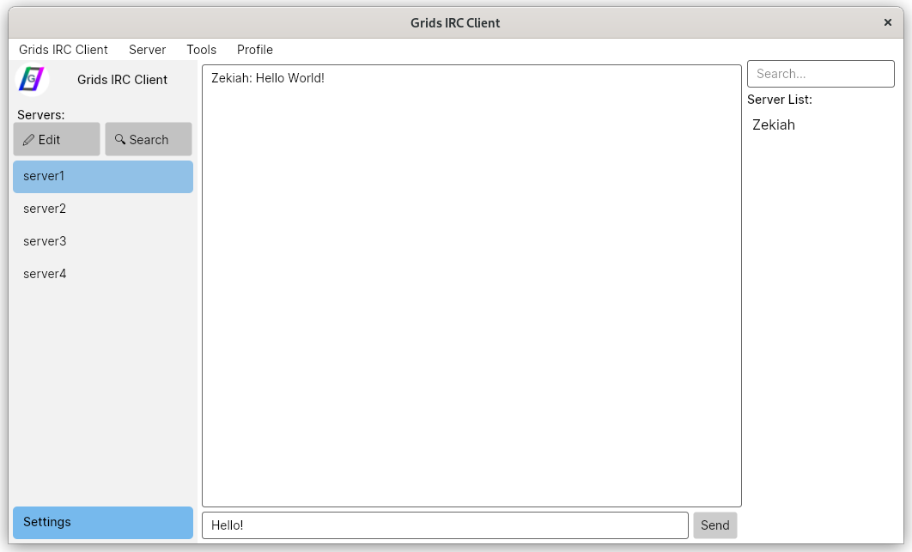

# GridsIRCClient
 A modern C# IRC Client, imitating clients such as HexChat, written using the Avalonia UI framework.

### Planned features:
- Tabbed channels.
- Hide join / quit messages.
- Colour coded messages & autocomplete / insert character.
- "Profile" popup for each user, like that on discord, displaying whois info
- Reorder & Arrange servers.
- Amount of missed messages bubble next to server name.
- System notifications from friended users.
- Emoji keyboard. Gtk on linux, UWP on windows?

